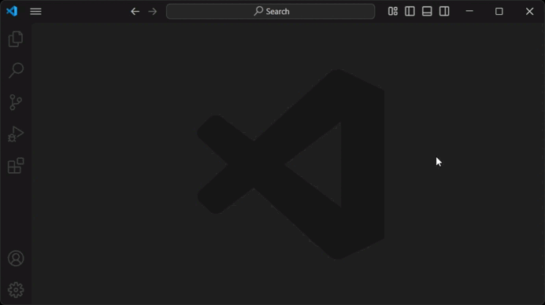

Русский | [English](README.md)

# Quick Temp File

[](https://code.visualstudio.com) [](https://marketplace.visualstudio.com/items?itemName=slyf.quick-temp-file) [](https://marketplace.visualstudio.com/items?itemName=slyf.quick-temp-file)

Расширение, позволяющее быстро создавать или открывать временные файлы. Забудьте о ручном создании файлов для заметок, фрагментов кода или временных данных!

## Использование

### 1. Создать или открыть файл... (Интерактивная команда)

* **Команда:** `Quick Temp File: Создать или открыть файл...`
* **Что делает:** Открывает диалоговое окно для создания или выбора файла.

*Демонстрация:*



### 2. Создать мгновенный файл (Команда без диалога)

* **Команда:** `Quick Temp File: Создать мгновенный файл`
* **Что делает:** **Мгновенно** создает и открывает новый временный файл со случайным уникальным именем (UUID) и расширением по умолчанию.

## Настройки расширения

* **`quickTempFile.deleteOnExit`**: Удаляет временные файлы, созданные в текущей сессии, при выходе из VS Code. (По умолчанию: `false`).
* **`quickTempFile.defaultPath`**: Каталог по умолчанию для создания временных файлов. (По умолчанию: системная временная папка).
* **`quickTempFile.defaultExtension`**: Расширение файла по умолчанию. (По умолчанию: `.txt`).

## Для разработчиков (API)

Расширение предоставляет внутреннюю команду для программного использования в других расширениях, задачах `tasks.json` или сложных настройках `keybindings.json`.

* **ID Команды:** `quickTempFile.api.create`
* **Аргументы:** `(args: object)`

Объект `args` может содержать следующие поля:

| Поле | Тип | По умолчанию | Описание |
| :--- | :--- | :--- | :--- |
| `noDialog` | `boolean`| `false` | Если `true`, файл создается немедленно без диалогового окна. |
| `filename` | `string` | `undefined` | Конкретное имя для нового файла. Указание имени также подразумевает `noDialog: true`. |
| `content` | `string` | `undefined` | Начальное содержимое для нового файла. |
| `directory`| `string \| null` | `undefined` | Переопределяет директорию по умолчанию. `null` использует системную временную папку. |
| `extension`| `string` | `undefined` | Переопределяет расширение файла по умолчанию. |
| `quiet` | `boolean` | `false` | Если `true`, подавляет все информационные уведомления (кроме ошибок), например, "Файл создан". |
| `contentFromClipboard` |	`boolean` |	`false` |	Если `true`, содержимое файла будет взято из системного буфера обмена. Переопределяет `content`, если переданы оба. |

#### Примеры вызова

**Создание файла с контентом через `keybindings.json`:**
```json
{
  "key": "ctrl+alt+s",
  "command": "quickTempFile.api.create",
  "args": {
    "filename": "my-snippet.js",
    "content": "console.log('My Snippet');"
  }
}
```

**Полностью "тихий" вызов из другого расширения (TypeScript):**
```typescript
// Создать файл мгновенно, без диалога и без уведомления об успехе.
// Ошибки все равно будут показаны.
await vscode.commands.executeCommand('quickTempFile.api.create', {
  noDialog: true,
  quiet: true,
  content: 'This was created silently.'
});
```